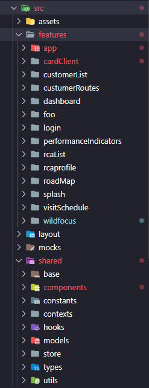

<br />
<p align="center">
  <h3 align="center">App Gestão Força de Vendas</h3>

<details open="open">
  <summary>Sumário</summary>
  <ol>
    <li><a href="#Sobre o projeto">Sobre o projeto</a></li>
    <li><a href="#Tecnologias">Tecnologias</a></li>
    <li><a href="#Desafios">Desafios</a></li>
    <li><a href="#Estrutura de pastas">Estrutura de pastas</a></li>
    <li><a href="#Padronização de código">Padronização de código</a></li>
    <li><a href="#Desenho arquitetural">Desenho arquitetural</a></li>
    <li><a href="#Instalação">Instalação</a></li>
    <li><a href="#Testes">Testes</a></li>
    <li><a href="#Publicação Android">Publicação Android</a></li>
  </ol>
</details>

## Sobre o projeto

APP desenvolvido para atender a gestão de vendas, gestão de equipe e resultados de incentivos voltados para a força de vendas do Atacado Martins, com solução de sugestão de rotas de atendimento, agenda, central de comunicação com o Trade, acompanhamento do Programa BEM e Martins a Bordo.

## Tecnologias

Principais tecnologias utilizadas
* React Native
* TypeScript
* Jest
* Styled Components
* WatermelonDB
* React Native Maps
* Axios
* Eslint e Prettier
## Principais Packages

* Banco de dados local (Watermelon DB)
  - @nozbe/watermelondb
  - @nozbe/with-observables

* Estilização 
  - styled-components

* Navegação
  - @react-navigation (native, bottom-tabs, drawer, material-top-tabs, stack)
    - react-native-tab-view

* HTTP Request
  - axios

* Icones
  - react-native-vector-icons

* Storage
  - @react-native-community/async-storage

* Tratativas de datas
  - date-fns
    - date-fns-tz

* SVG
  - react-native-svg
  - react-native-svg-transformer

* Mapa & Geolocation
  - react-native-maps
  - react-native-geolocation-service

* Animações & interações
  - react-native-reanimated
  - react-native-gesture-handler
  - react-native-snap-carousel

* Tests
  - Unitários (Jest)
    - Usamos para testes de lógicas. Scripts que não necessariamente são componentes

  - Testes de componentes - unitário/integração - (Jest + @testing-library/react-native)
    - Usamos para fazer testes de componentes

  - E2E (detox)
    - OBS. Algumas limitações e falta de conhecimento nos privaram de continuar usando,
    mas ainda acreditamos que vale a pena tentar mais uma vez, por isso a mantemos no projeto.
    Em caso de avanços, atualizaremos

* Linters & code improvement
  - eslint (+ complementares)
  - husky


## Desafios

* Rodar o aplicativo na mesma versão no Android e iOS
* Funcionalidades funcionando offline
* Usabilidade atendendo ao público alvo

## Estrutura de pastas



## Padronização de código

- **Geral**
    - Componentes estão sendo criados com extensão com .tsx
    - Estrutura da features estão corretas (views, services, utils)
    - Componentes que podem ser reutilizados estão no @shared
    - Componentes não fazem requisições diretas ao banco
    - Funções estão sendo externalizadas para arquivo de utils
    - Componentes de estilo estão sendo criados com terminação SC
    - Index somente exportando módulos
- **Features**
    - Repository e Manager
- **Banco de dados**
    - TableSchema
    - TableModel
    - DTOs (Interfaces)
    - Mappers (Optional)
    - Migrations (Required)

## Desenho arquitetural

<h4>Em construção...</h4>

## Instalação

1. Instale as dependências com Yarn
   ```sh
   yarn install
   ```
1. Iniciar o Metro
    ```sh
    yarn start
    ```
2. Rode o projeto
    Android
   ```sh
   yarn android
   ```
   iOS
   ```sh
   yarn ios
   ```

## Testes

- Testes unitários com Jest
- Testes de Componentes com Snapshot

## Publicação pela pipeline

1. Entre no arquivo package.json
2. Altere a versão
3. Envie a branch para o ambiente remoto
4. Entre no AzureDevOps na Aba Pipelines
5. Selecione o repositório do app
6. Clica em Run Pipeline na aba superior direita
7. Selecione a branch que você subiu
8. Aguarde fazer o build e após isso aprove para subir nas lojas

## Publicação Android

1. Entrar na pasta Android
2. Abrir o arquivo build.gradle em android/app
3. Alterar o versionCode e versionName
4. Criar o arquivo [grade.properties](http://grade.properties) (~/.gradle/gradle.properties)

```sh
MYAPP_UPLOAD_STORE_FILE=production.keystore
MYAPP_UPLOAD_KEY_ALIAS=production
MYAPP_UPLOAD_STORE_PASSWORD=****
MYAPP_UPLOAD_KEY_PASSWORD=****
```

5. Senha do Keystone está acima no Notion
6. Adicionar o arquivo production.keystore na pasta android/app
7. Rodar o comando ./gradlew bundleRelease
8. Criar uma nova branch com a nova versão
9. Acessar o teste interno na playstore console
10. Criar uma nova versão
11. Fazer o upload do arquivo gerado em
```sh
android/app/build/outputs/bundle/release/app-release.abb
```
